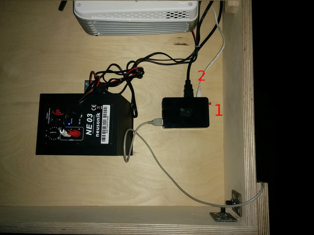

# Démarrer l'installation

- Brancher les 4 prises repérées avec du scotch rouge
- Allumer les vidéo projecteurs grace à la télécommande se trouvant au dessus du module à gauche près de l'entrée
- Remettre la télécommande à sa place
- Sur le gradateur, mettre la tranche numéro 1 à 40%

Tout devrait démarrer, si ce n'est pas le cas :

- Appuyer sur le petit bouton rouge du boitier noir (voir photo, repère 1)
- Débrancher puis rebrancher le fil blanc du boitier noir (voir photo, repère 2)

Répéter cela jusqu'à ce que la vidéo apparaisse.

# Si l'installation ne marche plus

- Appuyer sur le petit bouton rouge du boitier noir (voir photo, repère 1)
- Débrancher puis rebrancher le fil blanc du boitier noir (voir photo, repère 2)

Répéter cela jsuqu'à ce que la vidéo apparaisse.

# Eteindre l'installation

- Appuyer sur le petit bouton rouge du boitier noir (voir photo, repère 1)
- Eteindre les vidéo projecteurs (appuyer deux fois sur le bouton rouge de la télécommande)
- Attendre que les 5 vidéo projecteurs bippent
- Remettre la télécommande à sa place
- Débrancher les 4 prises repérées par un scotch rouge
- Sur le gradateur, mettre la tranche numéro 1 à 0%

# En cas de soucis

Vous pouvez joindre Xavier Seignard:
- 0033 6 83 03 73 74
- xavier.seignard@gmail.com

# Photo

